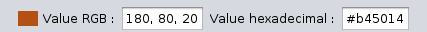

# Color selector 

## Find a color

It's an easy color selector you have 
a bar of color on the bottom you just have to click the type of color you want 

Then you have a panel of variation of this color 

select the color you want and on the top you get the value rgb and hex

## Show the color 

on the top you have that

you just have to put in the correct case your color in rgb or hex